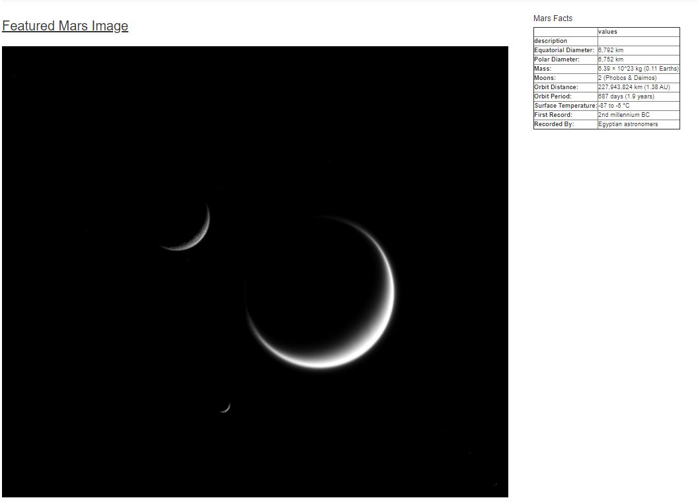
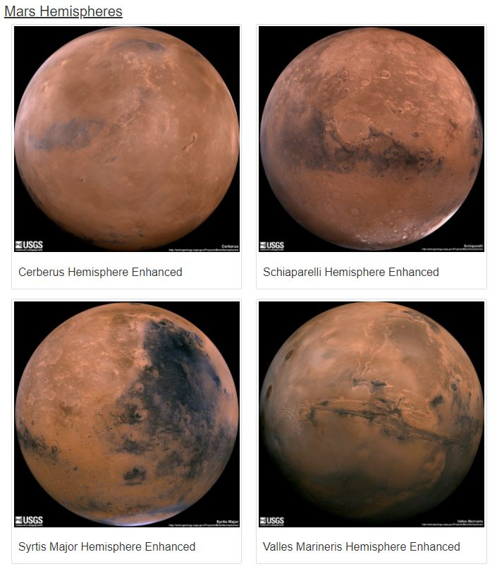

# web-scraping-challenge

This homework has several steps:

## Step1: Scraping

Jupyter Notebook file called `mission_to_mars.ipynb` to complete all of the scraping and analysis tasks

This includes visiting the following URLs to scrape the associated info from them:

* https://mars.nasa.gov/news/?page=0&per_page=40&order=publish_date+desc%2Ccreated_at+desc&search=&category=19%2C165%2C184%2C204&blank_scope=Latest

   to collect the latest News Title and Paragraph Text

* https://www.jpl.nasa.gov/spaceimages/?search=&category=Mars

  to collect current Featured Mars Image

* https://space-facts.com/mars/

  to collect Mars facts in a table

* https://astrogeology.usgs.gov/search/results?q=hemisphere+enhanced&k1=target&v1=Mars

  to obtain high resolution images for each of Mars' hemispheres.

at the end the code will append the dictionary with the image url string and the hemisphere title to a list. This list will contain one dictionary for each hemisphere.

## Step 2 - MongoDB and Flask Application

MongoDB with Flask templating are used to create a new HTML page that displays all of the information that was scraped from the URLs above.

Jupyter notebook was converted into a Python script called `scrape_mars.py` with a function called `scrape` that will execute all of the scraping code from above and return one Python dictionary containing all of the scraped data.

app.py has a route called `/scrape` that will import the  `scrape_mars.py` script and call the `scrape` function and a root route `/` that will query the Mongo database and pass the mars data into an HTML template to display the data.

template HTML file called `index.html`  will take the mars data dictionary and display all of the data in the appropriate HTML elements.

here is how the final product looks like: (this will change each time you run the app)

